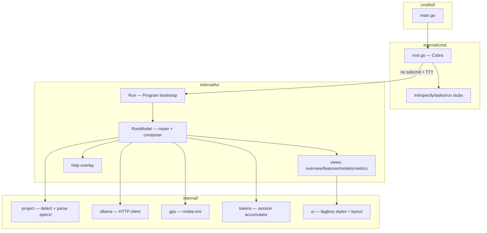
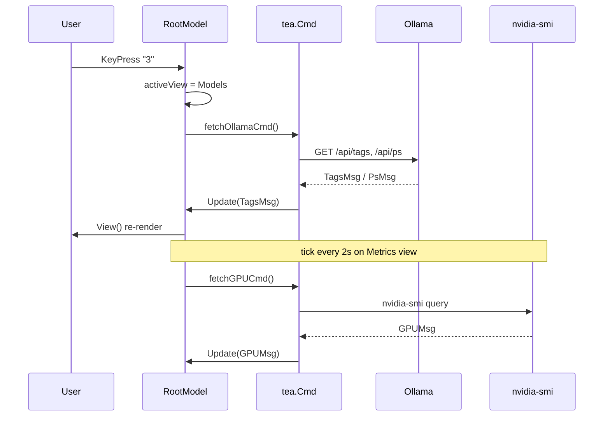

# CLI Scaffold Design

**Spec**: `.specs/features/cli-scaffold/spec.md`
**Status**: Draft

---

## Architecture Overview

O tui-sdd-llm-local opera em **dois modos** que compartilham pacotes internos mas não se misturam em runtime:

| Modo | Trigger | Runtime |
| ---- | ------- | ------- |
| **TUI** | `tsll` (TTY, `TSLL_TUI≠0`) | Bubble Tea alt-screen, root model orquestra views |
| **Plain** | `tsll --help`, `tsll init`, pipe, `TSLL_TUI=0` | Cobra stdout, sem Bubble Tea |

A TUI segue **Elm Architecture** (Bubble Tea): um `RootModel` roteia mensagens, compõe child models e dispara commands assíncronos para I/O (Ollama, GPU, filesystem).



### Message flow (Bubble Tea)



### Design principles

1. **Root model = router only** — não renderiza conteúdo de view; delega para `ViewRenderer` por `activeView`
2. **I/O só em `tea.Cmd`** — HTTP Ollama e subprocess GPU nunca bloqueiam `Update`
3. **Services sem Bubble Tea** — `internal/ollama`, `internal/gpu`, `internal/project` testáveis sem TTY
4. **Fail-soft** — Ollama down ou GPU ausente degradam painéis, não derrubam TUI

---

## Research Notes

| Topic | Source | Finding |
| ----- | ------ | ------- |
| Ollama `/api/tags` | [docs.ollama.com/api/tags](https://docs.ollama.com/api/tags) | `ListResponse{ models: [] }` com `name`, `size`, `modified_at`, `details` |
| Ollama `/api/ps` | [docs.ollama.com/api/ps](https://docs.ollama.com/api/ps) | `ProcessResponse{ models: [] }` com `expires_at`, `size_vram`, `context_length` |
| Token counts | [docs.ollama.com/api/generate](https://docs.ollama.com/api/generate) | `prompt_eval_count` → prompt; `eval_count` → completion (último chunk em stream) |
| Bubble Tea | [charmbracelet/bubbletea](https://github.com/charmbracelet/bubbletea) | Model/Update/View; child models; `tea.WindowSizeMsg`, `tea.KeyPressMsg` |
| GPU | `nvidia-smi` man page | `--query-gpu=index,name,utilization.gpu,memory.used,memory.total,temperature.gpu --format=csv,noheader,nounits` |

---

## Code Reuse Analysis

### Existing Components to Leverage

| Component | Location | How to Use |
| --------- | -------- | ---------- |
| _Nenhum código Go existente_ | — | Greenfield — estabelecer convenções aqui |
| Skill tlc-spec-driven | `.cursor/skills/tlc-spec-driven/` | Referência para paths `.specs/`, nomes de arquivos, parsing de STATE/ROADMAP |
| Project docs | `.specs/project/*.md` | Dogfooding: Overview view lê estes arquivos no próprio repo |

### Integration Points

| System | Integration Method |
| ------ | ------------------ |
| Ollama | HTTP `http://localhost:11434` (env `OLLAMA_HOST` override) |
| NVIDIA GPU | Subprocess `nvidia-smi` com timeout 3s |
| Filesystem | Walk-up desde `os.Getwd()` até `/` procurando `.specs/project/PROJECT.md` |
| Cobra | Root command `RunE` decide TUI vs erro; subcommands independentes |

---

## Package Structure

```
tui-sdd-llm-local/
├── cmd/tsll/
│   └── main.go                 # entry; chama cmd.Execute()
├── internal/
│   ├── cmd/
│   │   ├── root.go             # Cobra root, version, TUI dispatch
│   │   ├── init.go             # stub
│   │   ├── specify.go          # stub
│   │   ├── tasks.go            # stub
│   │   └── run.go              # stub
│   ├── tui/
│   │   ├── app.go              # Run(), Program options (alt-screen)
│   │   ├── model.go            # RootModel, Update router
│   │   ├── messages.go         # custom tea.Msg types
│   │   ├── keys.go             # keymap + help overlay content
│   │   └── views/
│   │       ├── overview.go
│   │       ├── features.go
│   │       ├── models.go
│   │       └── metrics.go
│   ├── project/
│   │   ├── detect.go           # FindRoot(cwd) → ProjectContext
│   │   └── parse.go            # Parse STATE.md, ROADMAP.md (lightweight)
│   ├── ollama/
│   │   ├── client.go           # HTTP client interface
│   │   └── types.go            # JSON structs
│   ├── gpu/
│   │   └── nvidia.go           # Query(), parse CSV
│   ├── tokens/
│   │   └── session.go          # SessionCounter
│   └── ui/
│       ├── styles.go           # lipgloss styles (k9s palette)
│       └── layout.go           # header, tabs, footer, panel boxes
├── go.mod
├── Makefile
└── .specs/                     # já existe
```

---

## Components

### 1. Entry & Cobra Root (`internal/cmd`)

- **Purpose**: Parsing de argv, dispatch TUI vs plain, registro de subcomandos
- **Location**: `internal/cmd/root.go`
- **Interfaces**:

```go
// Execute runs the Cobra root command.
func Execute() error

// ShouldLaunchTUI returns true when default interactive mode applies.
func ShouldLaunchTUI() bool
// true when: no subcommand args, stdout is TTY, TSLL_TUI != "0"
```

- **Dependencies**: `internal/tui`, `spf13/cobra`
- **Reuses**: —
- **Maps to**: SCAFF-15..19, SCAFF-35..39

**Dispatch logic:**

```
args = os.Args[1:]
if len(args)==0 || (len(args)==1 && args[0] starts with "-") && !hasSubcommand:
    if ShouldLaunchTUI() → tui.Run()
    else → print plain hint + os.Exit(0)
else → cobra.Execute()
```

Cobra `SilenceUsage: true` em erros; mensagens via `internal/ui` plain helpers.

---

### 2. TUI Bootstrap (`internal/tui/app.go`)

- **Purpose**: Configurar `tea.Program` com alt-screen, mouse off, title
- **Location**: `internal/tui/app.go`
- **Interfaces**:

```go
func Run() error
// tea.NewProgram(NewRootModel(), tea.WithAltScreen())
```

- **Dependencies**: bubbletea
- **Maps to**: SCAFF-01, SCAFF-06

---

### 3. Root Model (`internal/tui/model.go`)

- **Purpose**: Estado global TUI, roteamento de mensagens, composição de views
- **Location**: `internal/tui/model.go`, `internal/tui/messages.go`, `internal/tui/keys.go`
- **Interfaces**:

```go
type ViewID int
const (
    ViewOverview ViewID = iota + 1
    ViewFeatures
    ViewModels
    ViewMetrics
)

type RootModel struct {
    width, height   int
    activeView      ViewID
    showHelp        bool
    project         project.ProjectContext
    ollama          ollama.Snapshot
    gpu             gpu.Snapshot
    tokens          tokens.SessionCounter
    features        []project.FeatureEntry
    loading         map[string]bool  // "ollama", "gpu", "project"
    errBanner       string           // top banner e.g. ollama unreachable
    keymap          KeyMap
}

func NewRootModel() RootModel
func (m RootModel) Init() tea.Cmd
func (m RootModel) Update(msg tea.Msg) (tea.Model, tea.Cmd)
func (m RootModel) View() string
```

- **Dependencies**: all internal services, bubbles/spinner
- **Maps to**: SCAFF-01..14, SCAFF-20..34

**Update routing (order matters):**

1. `tea.KeyMsg` — global keys first (`q`, `?`, `1-4`, `r`, `ctrl+c`)
2. `tea.WindowSizeMsg` — resize all views
3. Custom msgs — `OllamaTagsMsg`, `OllamaPsMsg`, `GPUMsg`, `ProjectMsg`, `TokenUsageMsg`
4. `tea.TickMsg` — GPU refresh when `activeView == Metrics` or always (2s interval)

**Init commands (parallel batch):**

```go
tea.Batch(
    loadProjectCmd(),
    fetchOllamaCmd(),
    fetchGPUCmd(),
    tea.Tick(2*time.Second, tickGPU),
)
```

---

### 4. View Renderers (`internal/tui/views/`)

- **Purpose**: Render puro por view; sem side effects
- **Location**: `internal/tui/views/*.go`
- **Interfaces**:

```go
func RenderOverview(m OverviewData) string
func RenderFeatures(m FeaturesData) string
func RenderModels(m ModelsData) string
func RenderMetrics(m MetricsData) string
```

Cada `*Data` struct é subset do `RootModel` — facilita testes de snapshot.

- **Dependencies**: `internal/ui` (styles, panels, tables)
- **Maps to**: SCAFF-08..14

**Overview panel** lê:
- `project.Root`, `project.Valid`, `project.CurrentWork`, `project.Milestone`
- CTA se `!project.Valid`: `Press i to init` (key `i` → stub toast "use: tsll init")

**Features panel** lista:
- `filepath.Glob(".specs/features/*/spec.md")` → nome do dir, badges `spec` / `tasks` / `design`

**Models panel** usa `bubbles/table` para installed + running side-by-side ou stacked.

**Metrics panel** combina `tokens.SessionCounter` + `gpu.Snapshot` em dois sub-panels.

---

### 5. UI Layer (`internal/ui`)

- **Purpose**: Estilos k9s-like centralizados, layout helpers
- **Location**: `internal/ui/styles.go`, `internal/ui/layout.go`
- **Interfaces**:

```go
func Header(title string, tabs []Tab, active int, width int) string
func Footer(keymap string, width int) string
func Panel(title, content string, width, height int) string
func BannerError(msg string, width int) string
func PlainError(msg string) string  // for Cobra mode, respects NO_COLOR
```

**Palette (k9s-inspired):**

| Element | lipgloss |
| ------- | -------- |
| Header bg | `Color("62")` (blue) |
| Active tab | bold + underline |
| Error | `Color("196")` |
| Success | `Color("42")` |
| Dim/hint | `Faint(true)` |
| Panel border | `Border(lipgloss.RoundedBorder())` |

- **Maps to**: SCAFF-02, SCAFF-03, SCAFF-05, SCAFF-12, SCAFF-16..20

---

### 6. Project Service (`internal/project`)

- **Purpose**: Detectar e parsear contexto `.specs/`
- **Location**: `internal/project/detect.go`, `internal/project/parse.go`
- **Interfaces**:

```go
type ProjectContext struct {
    Root         string    // absolute path to project root
    Valid        bool      // PROJECT.md exists
    Corrupted    bool      // .specs/project/ exists but PROJECT.md missing
    CurrentWork  string    // from STATE.md
    Milestone    string    // from ROADMAP.md "Current Milestone"
}

type FeatureEntry struct {
    Name       string
    HasSpec    bool
    HasTasks   bool
    HasDesign  bool
}

func FindProject(cwd string) (ProjectContext, error)
func ListFeatures(projectRoot string) ([]FeatureEntry, error)
func ParseCurrentWork(statePath string) string
func ParseMilestone(roadmapPath string) string
```

**Detection algorithm:**

```
dir = cwd
loop:
    if exists(dir/.specs/project/PROJECT.md) → Valid=true, Root=dir
    if exists(dir/.specs/project/) && !PROJECT.md → Corrupted=true
    parent = dirname(dir)
    if parent == dir → break (reached /)
    dir = parent
return Valid=false
```

Resolve symlinks via `filepath.EvalSymlinks` on cwd.

- **Maps to**: SCAFF-08, SCAFF-09, SCAFF-14, edge cases corrupted/symlink

---

### 7. Ollama Client (`internal/ollama`)

- **Purpose**: Fetch model lists e running processes
- **Location**: `internal/ollama/client.go`, `internal/ollama/types.go`
- **Interfaces**:

```go
const DefaultBaseURL = "http://127.0.0.1:11434"
const DefaultModel   = "qwen2.5-coder"

type Client interface {
    Tags(ctx context.Context) ([]TagModel, error)
    Ps(ctx context.Context) ([]RunningModel, error)
    Reachable(ctx context.Context) bool
}

type Snapshot struct {
    Tags      []TagModel
    Running   []RunningModel
    Reachable bool
    Error     string
    FetchedAt time.Time
}

func NewClient(baseURL string) Client
func FetchSnapshot(ctx context.Context, c Client) Snapshot
```

- **HTTP**: `net/http` com timeout 5s; base URL de `OLLAMA_HOST` ou default
- **Maps to**: SCAFF-25..29

**Warning logic:** se nenhum tag `Name` contém `qwen2.5-coder` → flag `DefaultModelMissing` na view.

---

### 8. GPU Service (`internal/gpu`)

- **Purpose**: Métricas NVIDIA via subprocess
- **Location**: `internal/gpu/nvidia.go`
- **Interfaces**:

```go
type Device struct {
    Index       int
    Name        string
    Utilization float64  // percent
    MemoryUsed  uint64   // MiB
    MemoryTotal uint64   // MiB
    Temperature float64  // Celsius
}

type Snapshot struct {
    Devices   []Device
    Available bool   // nvidia-smi found and parsed
    Error     string
    Stale     bool   // last fetch failed, showing cached
    FetchedAt time.Time
}

func Query(ctx context.Context) (Snapshot, error)
```

**Command:**

```bash
nvidia-smi --query-gpu=index,name,utilization.gpu,memory.used,memory.total,temperature.gpu \
  --format=csv,noheader,nounits
```

Context timeout 3s. Se `exec.LookPath("nvidia-smi")` falha → `Available=false`, sem error fatal.

- **Maps to**: SCAFF-30..34

---

### 9. Token Session (`internal/tokens`)

- **Purpose**: Acumular tokens da sessão TUI; preparar integração com `tsll run`
- **Location**: `internal/tokens/session.go`
- **Interfaces**:

```go
type SessionCounter struct {
    PromptTokens     int
    CompletionTokens int
    TotalTokens      int
    RequestCount     int
    LastRequest      *UsageSnapshot
}

type UsageSnapshot struct {
    PromptTokens     int
    CompletionTokens int
    At               time.Time
}

func (s *SessionCounter) Add(promptEval, evalCount int)
func FromOllamaResponse(promptEvalCount, evalCount int) UsageSnapshot
```

**Mapping:** `prompt_eval_count` → `PromptTokens`; `eval_count` → `CompletionTokens`.

No scaffold: expor `TokenUsageMsg` para testes; sem chamadas reais até M3. Opcional: `tsll run --dry` mock na integração.

- **Maps to**: SCAFF-20..24

---

## Data Models

### Ollama API types

```go
// internal/ollama/types.go

type ListResponse struct {
    Models []TagModel `json:"models"`
}

type TagModel struct {
    Name       string       `json:"name"`
    Model      string       `json:"model"`
    ModifiedAt time.Time    `json:"modified_at"`
    Size       int64        `json:"size"`
    Details    ModelDetails `json:"details"`
}

type ProcessResponse struct {
    Models []RunningModel `json:"models"`
}

type RunningModel struct {
    Name          string       `json:"name"`
    Model         string       `json:"model"`
    Size          int64        `json:"size"`
    ExpiresAt     time.Time    `json:"expires_at"`
    SizeVRAM      int64        `json:"size_vram"`
    ContextLength int          `json:"context_length"`
    Details       ModelDetails `json:"details"`
}

type ModelDetails struct {
    ParameterSize     string `json:"parameter_size"`
    QuantizationLevel string `json:"quantization_level"`
}
```

### TUI custom messages

```go
// internal/tui/messages.go

type OllamaSnapshotMsg struct { Snapshot ollama.Snapshot }
type GPUSnapshotMsg      struct { Snapshot gpu.Snapshot }
type ProjectLoadedMsg    struct { Ctx project.ProjectContext; Features []project.FeatureEntry }
type TokenUsageMsg       struct { Usage tokens.UsageSnapshot }
type RefreshRequestedMsg struct{} // key 'r'
```

---

## Keymap

| Key | Action | Scope |
| --- | ------ | ----- |
| `q` | Quit TUI | global |
| `ctrl+c` | Quit (exit 130) | global |
| `?` | Toggle help overlay | global |
| `1` | View Overview | global |
| `2` | View Features | global |
| `3` | View Models | global |
| `4` | View Metrics | global |
| `r` | Refresh Ollama + project | global |
| `i` | Init hint (stub) | Overview only |

Footer string: `r: refresh │ 1-4: views │ ?: help │ q: quit`

---

## Error Handling Strategy

| Error Scenario | Handling | User Impact |
| -------------- | -------- | ----------- |
| Ollama connection refused | `Snapshot.Reachable=false`; red banner in header | Models view: "Ollama unreachable" + hint |
| Ollama timeout (>5s) | Keep spinner; set `Error` on snapshot | Stale data or empty; keyboard responsive |
| nvidia-smi not found | `GPU.Available=false` | Metrics: "GPU metrics unavailable" |
| nvidia-smi timeout/error | `GPU.Stale=true`, cache last good | Dim error text + timestamp |
| Terminal < 80×24 | Render compact layout | Warning line in header |
| Non-TTY stdout | Skip TUI in root dispatch | Plain one-liner + exit 0 |
| Corrupted project | `Corrupted=true` | Overview: warning + suggest `tsll init --force` |
| Cobra unknown subcommand | `PlainError` + suggestions | No TUI; exit 1 |

**Nunca:** panic, stack trace na TUI, ou block do event loop.

---

## Testing Strategy

| Layer | Approach | Gate |
| ----- | -------- | ---- |
| `internal/project` | Table tests com temp dirs | `go test ./internal/project/...` |
| `internal/ollama` | `httptest.Server` mock JSON | `go test ./internal/ollama/...` |
| `internal/gpu` | Mock `exec` ou skip if no nvidia | test file + build tag `gpu` optional |
| `internal/tokens` | Unit tests Add/accumulate | pure logic |
| `internal/tui/views` | Snapshot tests (golden strings) | no TTY needed |
| `internal/cmd` | Test `ShouldLaunchTUI` matrix | env + fake TTY via pipes |

TUI root model: test `Update` com mensagens injetadas — sem `tea.NewProgram` em CI.

---

## Tech Decisions

| Decision | Choice | Rationale |
| -------- | ------ | --------- |
| Module path | `github.com/pedrobelmino/tui-sdd-llm-local` | Convenção; ajustar ao remote real |
| Go version | 1.22+ | Toolchain estável |
| Bubble Tea alt-screen | `tea.WithAltScreen()` | k9s-like full terminal; restore on quit |
| Child models | View renderers como funções puras, não sub-models | Menos boilerplate no scaffold; bubbles/table local |
| Ollama client | `net/http` manual | Sem dependência pesada; 2 endpoints só |
| GPU refresh | Global tick 2s | Simples; só parse quando Metrics active OR always (escolha: always — header pode mostrar GPU mini) |
| Config | Env vars only no scaffold | `OLLAMA_HOST`, `TSLL_TUI`, `NO_COLOR` — config file em M4 |
| Version embed | `-ldflags` via Makefile | `var version = "0.1.0-dev"` em `cmd/root.go` |

---

## Requirement → Component Map

| IDs | Component |
| --- | --------- |
| SCAFF-01..07 | `tui/app.go`, `tui/model.go`, `ui/layout.go` |
| SCAFF-08..14 | `tui/views/*`, `project/*` |
| SCAFF-15..19 | `cmd/root.go`, `cmd/*.go` stubs |
| SCAFF-20..24 | `tokens/session.go`, `tui/views/metrics.go` |
| SCAFF-25..29 | `ollama/*`, `tui/views/models.go` |
| SCAFF-30..34 | `gpu/nvidia.go`, `tui/views/metrics.go` |
| SCAFF-35..39 | `cmd/root.go`, `ui/styles.go` plain helpers |
| SCAFF-40..43 | `Makefile`, `go.mod` |

---

## Out of Scope (design boundary)

- Persistir token counts em disco (sessão só em memória)
- WebSocket streaming Ollama
- Mouse, split panes resizable
- Temas customizáveis
- `tsll init` implementation (apenas key `i` hint)

---

## Open Questions

| # | Question | Default if unanswered |
| - | -------- | --------------------- |
| 1 | Module path GitHub exato? | `github.com/pedrobelmino/tui-sdd-llm-local` |
| 2 | GPU tick sempre ou só na view Metrics? | Sempre (2s) — custo baixo |
| 3 | Mini GPU no header em todas views? | Sim — 1 linha util% + VRAM |

---

## Next Step

Após aprovação deste design → **`tasks`** para quebrar em tarefas atômicas com gate `go test ./...` e critérios por requirement ID.
