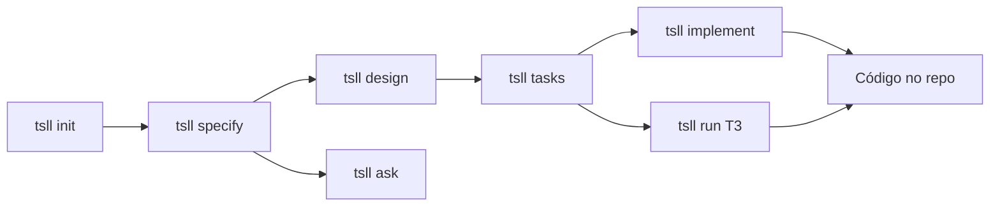

# tsll

**Spec-driven development no terminal — com IA local, visibilidade de GPU e zero nuvem.**

`tsll` (*TUI Spec-Driven Development — LLM Local*) é uma CLI Go com dashboard full-screen estilo **k9s**. Ela guia você do requisito ao código usando um fluxo estruturado, modelos via **Ollama** e artefatos rastreáveis em `.specs/`.

> Ideia → spec → design → tasks → implementação — tudo no mesmo lugar, com tokens e VRAM na tela.

```bash
git clone https://github.com/pedrobelmino/tui-sdd-llm-local.git
cd tui-sdd-llm-local
make build          # instala em ~/.local/bin/tsll
tsll doctor         # smoke test: Ollama + GPU + .specs/
tsll                # abre o dashboard
```

---

## Por que tsll?

Desenvolvimento assistido por IA costuma ser ad hoc: sem specs, sem memória entre sessões, sem visão do consumo de recursos, e sem fluxo claro do requisito à implementação.

**tsll resolve isso com:**

| | |
|---|---|
| **Fluxo guiado** | `init` → `specify` → `design` → `tasks` → `implement` / `run` |
| **100% local** | Ollama na sua máquina — sem API keys, sem nuvem |
| **Dashboard k9s-like** | GPU, VRAM, tokens, modelos e features num terminal interativo |
| **Rastreabilidade** | Requisitos com ID, tarefas com critérios, decisões em `STATE.md` |
| **Tool loop inteligente** | O modelo lê/escreve arquivos com guardrails para modelos pequenos (3B) |
| **Ask mode** | Perguntas read-only sobre spec/design/tasks sem tocar no código |

Funciona como **complemento** ao Cursor/IDE — não substitui — mas dá estrutura e visibilidade que um chat genérico não oferece.

---

## Demo do fluxo



**Exemplo completo** (projeto novo):

```bash
mkdir meu-app && cd meu-app
tsll init                          # cria .specs/project/
tsll specify landing-page --brief "Página inicial com header e footer"
tsll design landing-page           # design.md (opcional, features médias+)
tsll tasks landing-page            # tasks.md com T1, T2, …
tsll implement landing-page        # implementa todas as tarefas pendentes
# ou, tarefa a tarefa (recomendado com modelos 3B):
tsll run landing-page --task T3
```

Durante `implement` / `run`, o modelo usa ferramentas de arquivo (`read_file`, `write_file`, `list_dir`, …) num loop supervisionado — você vê cada passo na TUI ou no stdout.

---

## Dashboard TUI

Abra sem argumentos:

```bash
tsll
```

### Views

| Tecla | View |
|-------|------|
| `1` | **Overview** — visão geral do projeto |
| `2` | **Features** — specs, design, tasks, implement |
| `3` | **Models** — modelos Ollama disponíveis e em execução |
| `4` | **Metrics** — tokens consumidos na sessão |
| `5` | **System** — CPU, RAM, disco, load |

### Features (view `2`)

| Tecla | Ação |
|-------|------|
| `n` | Nova feature (nome + brief → gera spec) |
| `s` | Specify — gerar/atualizar `spec.md` |
| `d` | Design — gerar `design.md` |
| `t` | Tasks — gerar `tasks.md` |
| `p` | **Ask** — perguntas read-only sobre a feature |
| `e` | Implement — implementar feature inteira |
| `w` | Quick task — pedido ad-hoc |
| `enter` | Abrir detalhe da feature |

### Detalhe da feature

| Tecla | Ação |
|-------|------|
| `j` / `k` | Navegar tarefas |
| `e` / `enter` | Executar tarefa selecionada |
| `a` | Implement all — todas as tarefas pendentes |
| `p` | Ask sobre a feature |
| `y` | **Copiar log completo** para clipboard (fallback: `~/.tsll/last-action.log`) |
| `x` / `esc` | **Cancelar** ação em andamento |

Pressione `?` a qualquer momento para ver todos os atalhos.

---

## Comandos CLI

Todos os subcomandos funcionam fora da TUI — úteis para scripts e automação.

| Comando | Descrição |
|---------|-----------|
| `tsll` | Dashboard interativo |
| `tsll init` | Cria `.specs/project/` (PROJECT, ROADMAP, STATE) |
| `tsll specify <feature> --brief "…"` | Gera `spec.md` com requisitos rastreáveis |
| `tsll design <feature>` | Gera `design.md` |
| `tsll tasks <feature>` | Quebra em tarefas atômicas com critérios de verificação |
| `tsll implement <feature>` | Implementa tarefas pendentes via tool loop |
| `tsll run <feature> --task T3` | Executa uma tarefa específica |
| `tsll ask <feature> --question "…"` | Q&A read-only (spec + design + tasks) |
| `tsll validate [feature]` | Valida completude de spec/tasks |
| `tsll doctor` | Health check: Ollama, modelo, GPU, `.specs/` |

---

## Requisitos

- **Linux** (v1 — sem macOS/Windows por enquanto)
- **Go 1.22+** (build)
- **Ollama** rodando localmente
- Terminal ANSI, mínimo **80×24**
- GPU **AMD** ou **NVIDIA** (opcional — métricas degradam graciosamente)

---

## Instalação

### 1. Build

```bash
git clone https://github.com/pedrobelmino/tui-sdd-llm-local.git
cd tui-sdd-llm-local
make build
# binário em bin/tsll e copiado para ~/.local/bin/tsll
```

Certifique-se de que `~/.local/bin` está no `PATH`.

### 2. Ollama

```bash
curl -fsSL https://ollama.com/install.sh | sh
sudo systemctl enable --now ollama
ollama pull qwen2.5-coder:3b
```

### 3. Verificar

```bash
curl -s http://127.0.0.1:11434/api/tags   # API no ar
ollama ps                                  # modelo carregado
tsll doctor                                # checagem completa
```

Saída esperada do `doctor`:

```
✓ Ollama reachable at http://127.0.0.1:11434
✓ model qwen2.5-coder:3b available
✓ GPU [amd] … — util X% VRAM X/X MiB
✓ .specs/project at /caminho/do/projeto
```

**Dica:** mantenha o modelo na VRAM entre requests:

```bash
export OLLAMA_KEEP_ALIVE=30m
```

---

## Configuração

**Global:** `~/.tsll/config.yaml`

```yaml
model: qwen2.5-coder:3b
ollama_host: http://127.0.0.1:11434
gpu_prefer: amd      # amd | nvidia | auto
theme: k9s
fast_mode: true      # loop mais curto — melhor para GPUs modestas
```

**Por projeto:** `.tsllrc` no diretório do repo.

| Variável | Efeito |
|----------|--------|
| `OLLAMA_HOST` | URL do Ollama |
| `TSLL_MODEL` | Override do modelo |
| `TSLL_GPU_PREFER` | `amd` ou `nvidia` |
| `TSLL_FAST=0` | Desliga fast mode |
| `TSLL_TUI=0` | `tsll` sem args não abre TUI |
| `NO_COLOR` | Saída sem cores |

---

## Modelos recomendados

| Modelo | VRAM ~ | Uso |
|--------|--------|-----|
| `qwen2.5-coder:3b` | ~2 GB | **Padrão** — rápido, ideal para GPUs modestas |
| `qwen2.5-coder:7b` | ~5 GB | Melhor qualidade de código |
| `qwen2.5-coder:14b` | ~9 GB | Implementações mais assertivas |

Com modelos **3B**, prefira `tsll run <feature> --task Tn` (uma tarefa por vez) em vez de `implement` completo. O tool loop tem guardrails para modelos pequenos: bootstrap do layout, fail-fast em erros repetidos, e parsing tolerante de JSON malformado.

---

## Estrutura `.specs/`

O projeto segue as convenções da skill **[tlc-spec-driven](https://github.com/tech-leads-club/agent-skills)** (Tech Lead's Club):

```
.specs/
├── project/
│   ├── PROJECT.md      # visão, stack, escopo
│   ├── ROADMAP.md      # milestones
│   └── STATE.md        # decisões, blockers, memória entre sessões
├── codebase/           # brownfield mapping (arquitetura, convenções, testes…)
└── features/
    └── minha-feature/
        ├── spec.md     # requisitos com IDs
        ├── design.md   # decisões técnicas (opcional)
        └── tasks.md    # tarefas T1, T2… com critérios
```

O `implement` respeita a **stack definida em `PROJECT.md`** — mesmo que `design.md` mencione outra tecnologia, a implementação segue o que está no projeto.

---

## Como funciona por baixo

```
┌─────────────┐     ┌──────────────┐     ┌─────────────┐
│  Bubble Tea │────▶│   workflow   │────▶│   Ollama    │
│  TUI k9s    │     │ specify/tasks│     │  (local)    │
└─────────────┘     │ implement    │     └─────────────┘
                    └──────┬───────┘
                           │
                    ┌──────▼───────┐
                    │  file tools  │
                    │ read/write/  │
                    │ list/create  │
                    └──────────────┘
```

- **Go 1.22** + Cobra (CLI) + Bubble Tea / lipgloss (TUI)
- **Ollama HTTP API** com streaming e contagem de tokens
- **GPU metrics:** AMD (`amdgpu` + `rocm-smi`) e NVIDIA (`nvidia-smi`)
- **Host metrics:** `/proc` (CPU, RAM, swap) + `statfs` (disco)
- **Tool loop:** o modelo emite `<tool_call>{"tool":"write_file",…}</tool_call>`; o runtime executa, retorna resultado, e continua até concluir ou atingir limite

---

## Desenvolvimento

```bash
make test                    # go test ./...
make build                   # bin/tsll → ~/.local/bin/tsll
go test ./internal/tui/ -v   # testes da TUI
go test ./internal/ollama/ -v # parser de tool calls, loop
```

Guia para contribuidores e agentes de IA: [`AGENTS.md`](AGENTS.md)

Documentação de arquitetura do próprio projeto: `.specs/codebase/`

---

## Roadmap (v1)

**Incluído:**

- Dashboard TUI com métricas de GPU, tokens e sistema
- Fluxo completo: init → specify → design → tasks → implement / run
- Ask mode (read-only Q&A sobre features)
- Tool loop com guardrails para modelos pequenos
- Cancelamento de ações (`x` / `esc`) e cópia de log (`y`)
- `doctor` e `validate`
- Integração com convenções `tlc-spec-driven`

**Fora de escopo (v1):**

- Provedores LLM além do Ollama
- Interface web/desktop
- macOS / Windows
- Multi-agente paralelo
- Deploy / CI/CD

---

## Agradecimentos

Este projeto implementa o workflow da skill **[tlc-spec-driven](https://github.com/tech-leads-club/agent-skills/blob/main/packages/skills-catalog/skills/(development)/tlc-spec-driven/SKILL.md)** do [Tech Lead's Club](https://github.com/tech-leads-club/agent-skills), por Felipe Rodrigues ([@felipfr](https://github.com/felipfr)).

A estrutura `.specs/`, as fases **Specify → Design → Tasks → Execute** e os artefatos de brownfield mapping seguem as convenções documentadas na skill. Obrigado ao projeto open source por definir um fluxo claro e reutilizável para spec-driven development.

Skill `tlc-spec-driven`: [CC-BY-4.0](https://creativecommons.org/licenses/by/4.0/).

---

## Contribuindo

Issues e PRs são bem-vindos. Antes de abrir um PR:

1. `make test` passa
2. Mudanças focadas — sem refactors não relacionados
3. Para features novas, considere atualizar `.specs/features/` ou `AGENTS.md`

---

<p align="center">
  <strong>Feito para devs solo que querem estrutura, visibilidade e IA local.</strong><br>
  <code>tsll</code> — do spec ao código, no terminal.
</p>
